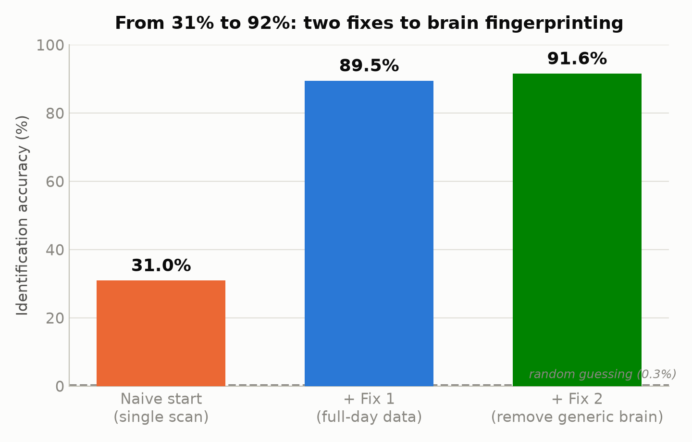
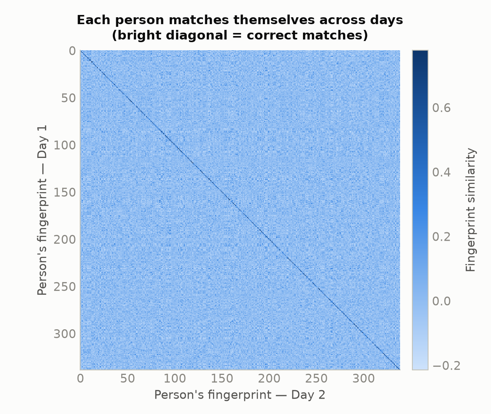
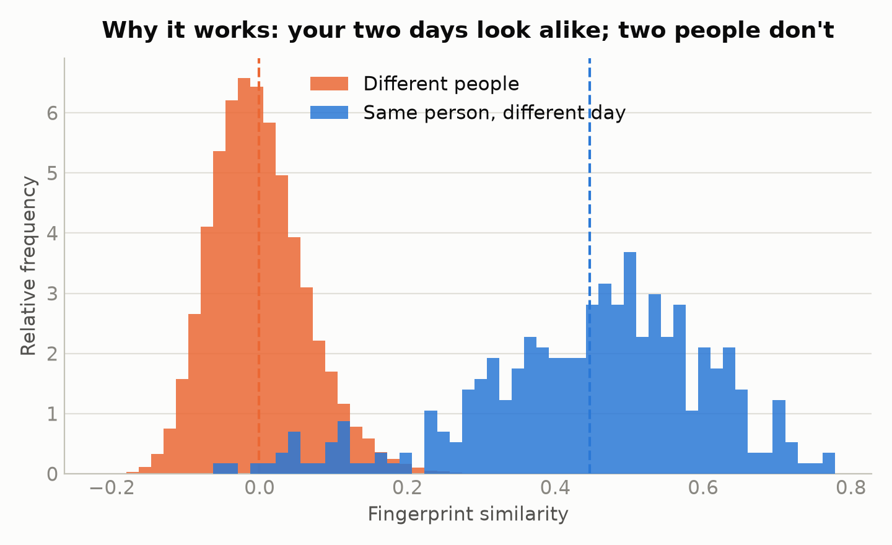
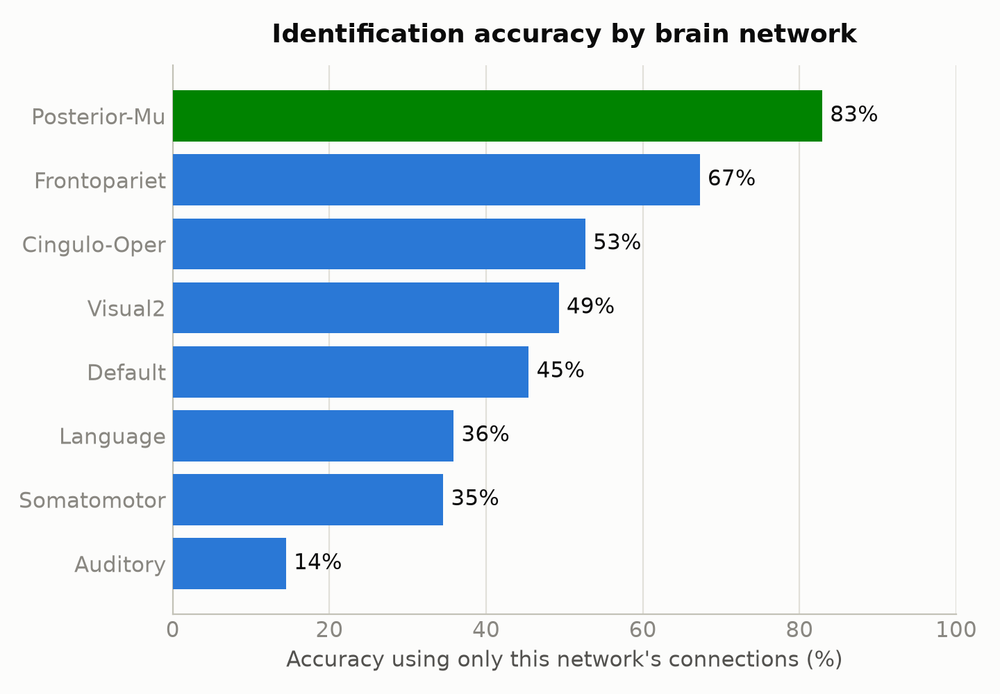
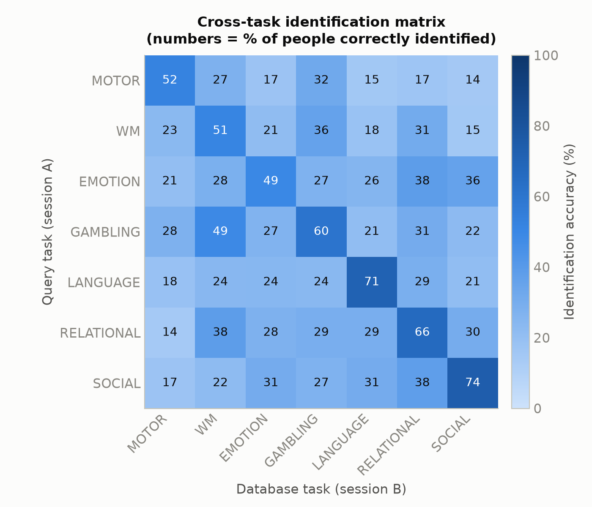
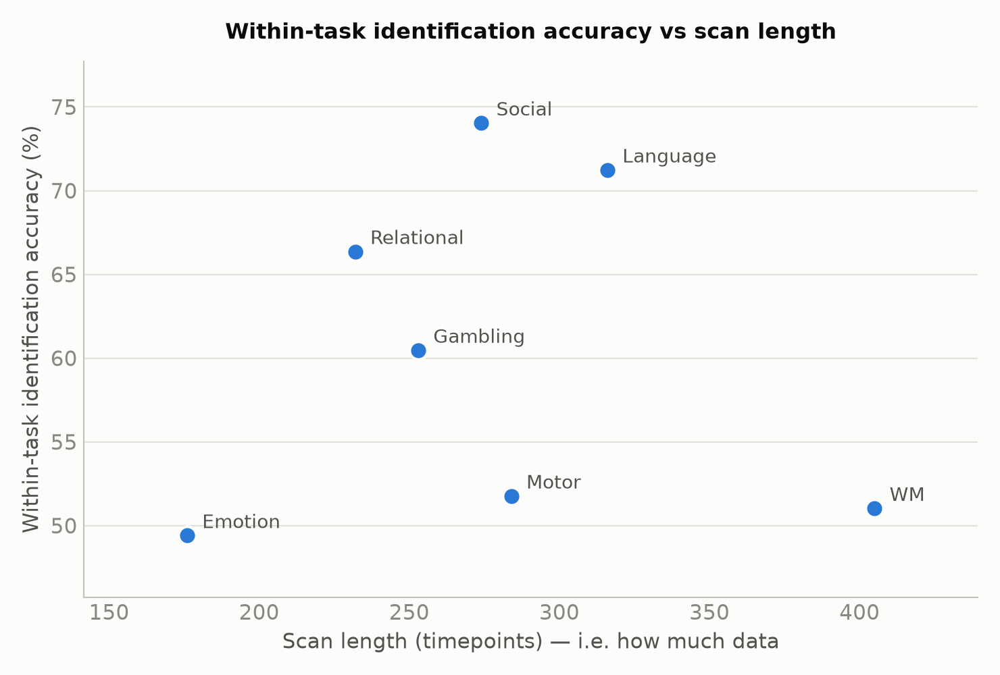
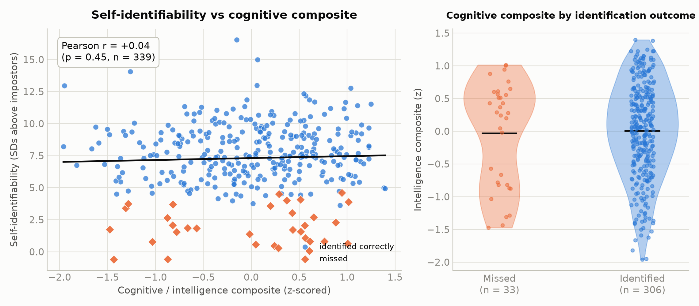

# Connectome Fingerprinting

**Can you identify a person from their brain's wiring pattern?** Every brain has
a pattern of *which regions tend to activate together*. Research (Finn et al.,
2015, *Nature Neuroscience*) says this pattern is stable and personal — like a
fingerprint. We test that on **339 people**, each scanned on **two different days**:

> Take a person's brain "fingerprint" from Day 1. Looking only at the 339
> fingerprints from Day 2, can we correctly pick that same person out?

Random guessing would be right **1 in 339 ≈ 0.3%**. We reach **91.6%** — and then
push further to ask *which* parts of the brain carry identity, whether it survives
a change of mental task, and whether smarter people are easier to identify.

It's a biometric **identification / retrieval** problem: high-dimensional features,
similarity search, careful validation, and honest handling of confounds — describable
with zero neuroscience.

---

## How to run it

```bash
pip install -r requirements.txt

python download.py     # OSF → data/       (fetches the full ~12 GB HCP dataset; skips what's already there)
python analyzer.py     # data → raw results/   (a few minutes of compute)
python visualiser.py   # results/ → figures/   (seconds; no dataset needed)
```

The pipeline is deliberately split into stages so the figures are decoupled from
the 12 GB dataset — anyone can clone the repo and reproduce every figure in
seconds from the committed `results/`, without running `download.py` at all.

### Project structure

```
├── download.py          STAGE 0 — fetches the HCP dataset from OSF into data/ (run once)
├── analyzer.py          STAGE 1 — loads data, runs every experiment, writes raw results
├── visualiser.py        STAGE 2 — reads results/, renders every figure (no dataset access)
├── requirements.txt     numpy, scipy, pandas, matplotlib
├── results/             raw result files  (committed — small)
├── figures/             the figures        (committed)
└── data/                the 12 GB HCP dataset  (git-ignored; fetched by download.py)
```

### Input files (what `analyzer.py` needs in `data/`)

Fetched from OSF by `python download.py`, into `./data/`:

| Input | Contents |
|---|---|
| `hcp_rest/` | resting-state scans — 4 per person (two per day), each a `360 regions × time` table |
| `hcp_task/` | task scans — 7 tasks × 2 runs per person, plus `regions.npy` (the network label of each region) |
| `hcp/behavior/` | in-scanner task performance (used to build the intelligence composite)¹ |

¹ The behavioural CSVs come bundled with the release; the figures don't need them,
since the results they feed are already baked into the committed `results/`.

### Output files

**`analyzer.py` → `results/`** (raw numbers, no plotting):

| File | Contents |
|---|---|
| `results.json` | every scalar result + metadata for all four analyses |
| `per_network.csv` | identification accuracy per brain network |
| `intelligence.csv` | per-subject intelligence composite + identifiability |
| `cross_task_grid.csv` | 7×7 cross-task identification-accuracy grid |
| `similarity_matrix.npy` | the 339×339 Day-1-vs-Day-2 similarity matrix |

**`visualiser.py` → `figures/`** (reads `results/` only):
`accuracy_climb.png`, `similarity_matrix.png`, `similarity_distributions.png`,
`networks.png`, `intelligence.png`, `cross_task_grid.png`, `task_specialisation.png`.

### The method, in four small steps

1. **A fingerprint** = for every *pair* of the 360 regions, how strongly they rise and fall together over time (correlation). That's `360 × 359 / 2 = 64,620` numbers per person.
2. **Similarity** = how alike two fingerprints are (correlation between the two lists of 64,620 numbers).
3. **Identification** = for each person's Day-1 fingerprint, guess that their most-similar Day-2 fingerprint is them.
4. **Accuracy** = fraction guessed correctly, averaged over both directions (Day 1→2 and 2→1).

---

# What we've tested so far — and what we found

## 1. Core result: identification from 31% → 92%

Our first naive attempt scored only **31%** — far above chance, but far below the
~90% the literature reaches. The whole gap was in *how carefully we prepared the
data*. Three fixes closed it:



- **Fix 1 — use more data (the big one).** Each day has *two* scans; a single short one is a blurry snapshot. Gluing both together (~2400 timepoints) gives a sharp fingerprint. This did almost all the work (31% → 89.5%).
- **Fix 2 — cancel a scanner artefact.** A day's two scans use *opposite* phase-encoding directions, so combining them cancels the warp instead of letting it fool the match. (Comes free with Fix 1.)
- **Fix 3 — subtract the "generic brain."** Everyone is broadly wired the same way; that shared pattern is loud and useless for telling people apart. Subtracting the group-average fingerprint leaves each person's *personal deviation* (89.5% → 91.6%).

The result shows up cleanly as a bright diagonal — everyone matches themselves across days:



…because a person's two days look alike, while two different people don't:



**Is Fix 3 cheating?** No. The average never looks at *who is who*, and Day 1's
average uses only Day 1, Day 2's only Day 2 — nothing leaks between the "question"
and the "answer." Every fix just cleans the data; the brains do the identifying.

## 2. Which networks make you identifiable? (Extension 1)

The 360 regions group into ~12 **networks** (vision, movement, attention, …). We
rerun identification using **only one network's connections** at a time.



The **higher-order association networks** (posterior-multimodal 83%, frontoparietal
67% — the systems for flexible, integrative thinking) carry the most identity.
**Primary sensory/motor networks** (auditory 14%, somatomotor 35%) carry the least.
The frontoparietal result reproduces Finn et al.'s headline finding.

## 3. Does identity survive a change of task? (Extension 2)

So far both fingerprints came from *resting*. The stronger claim: your fingerprint
persists across **different mental states**. We build a fingerprint per person per
task and match people **across** tasks.



- **Same task** (diagonal): **61%** — the harder, low-data regime (task runs are short).
- **Different task** (off-diagonal): **26%** — still ~90× above the 0.3% chance level.

Identity clearly survives a change of task. (The diagonal sits below the 92% rest
result only because each task run is short — ~200–400 timepoints vs. rest's ~2400.
It's Fix 1 unavailable, not a regression.)

## 4. The key insight — identifiability tracks *specialisation*, not data amount

The tasks that make people most identifiable are the **higher-order, cognitively
rich** ones. The obvious worry is "maybe the winners just had longer scans." They
didn't — the correlation between scan length and accuracy is **r = −0.01**, essentially
zero. Working-memory has the *most* data of any task yet sits near the bottom, while
social and language lead:



**Interpretation** (consistent across Extensions 1 and 2): identity lives in the
brain's **higher-order association systems** — social cognition, language, relational
reasoning; the frontoparietal and posterior-multimodal networks — far more than in
**primary sensory/motor systems**, which are more stereotyped across people. Two
independent analyses (per-network *and* per-task) point the same way.

## 5. Are smarter people easier to identify? (Extension 3) — a clean null

A natural question: are cognitively distinctive brains also *identity*-distinctive?
This release has no IQ field, so we build a **general-cognitive composite** from
three in-scanner tasks (working-memory 2-back accuracy, relational-reasoning accuracy,
and adaptive language-math difficulty), z-scored and averaged. We correlate it
against each person's **self-identifiability** (how many SDs their own across-day
match sits above the impostor crowd).



**Essentially no relationship** (Pearson r = +0.04, p = 0.45). The regression line is
flat; the 33 missed people span the full ability range. This is reassuring two ways:
(1) the fingerprint picks out *the person*, not a "smart brain" signal — an identity
biometric shouldn't rank people by ability, and this one doesn't; (2) it sharpens the
earlier findings — identity concentrates in the higher-order networks and tasks, but
*within* those systems it's idiosyncratic wiring, not general ability, that makes a
person unique. At n = 339 the design has ~80% power to detect even r ≈ 0.15, so this
is a real absence, not a failure to look.

---

## Why the numbers are trustworthy

- **Chance baseline** stated everywhere (0.3%); both matching directions agree.
- **No leakage:** identity labels are never used to build any transform; Day 1 and Day 2 are processed separately; for cross-task work each person is wholly in the query *or* the database, never split.
- **Phase-encoding confound** identified and controlled (Fix 2).
- **Confound check for the insight:** the r = −0.01 scan-length control rules out "more data" as the explanation for the specialisation pattern.
- **Well-powered null:** the intelligence result is reported as a genuine absence — at n = 339 the design has ~80% power to detect even a weak r ≈ 0.15.

## References

- **Finn et al. 2015**, *Nature Neuroscience* — connectome fingerprinting; the frontoparietal finding.
- **Glasser et al. 2016**, *Nature* — the 360-region atlas.
- **Amico & Goñi 2018**, *Scientific Reports* — "differential identifiability" (a natural next extension).
- **Noble, Scheinost & Constable 2021**, *NeuroImage* — reliability of connectome-based measures.
