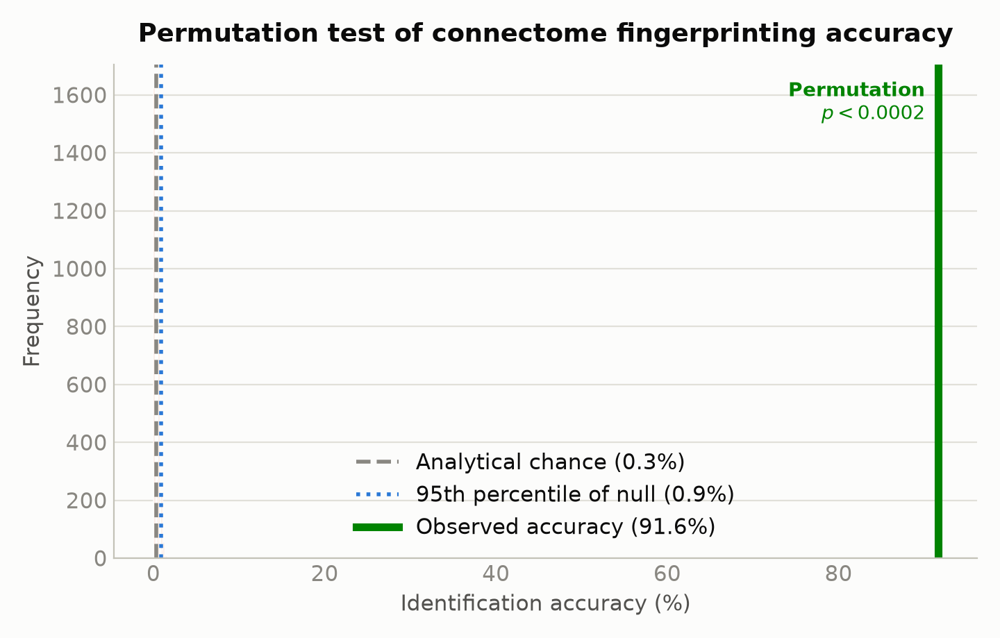

# Connectome Fingerprinting

**Can you idenitfy a person from their brains wiring patter?**
We know everyone's brain is unique, but research (*Finn et al. 2015*, *Nature Neuroscience*) has shown that we can use the patterns of how different regions of the brain activation rise and fall together to create a *stable and personal fingerprint*. We test this on **339 people** from the **HCP dataset**.

### Core experiment summary
1. Construct a person's fingerpring on Day 1 from their resting state fMRI data
2. Construct using the same method, a fingerprint of everyone in the dataset on another day (day 2)
3. Using the fingerprint from day 1, can we pick out the same person on day 2?


The analytical chance for this would be **1 in 339 ≈ 0.3%**. We reach **91.6%**.
We also question **which** parts of the brain _carry identity_, how well it survives a change of activity, and whether it is easier to identify people who are more intelligient. 

---
### Project structure

```
├── download.py          STAGE 0 — fetches the HCP dataset from OSF into data/ (run once)
├── analyzer.py          STAGE 1 — loads data, runs every experiment, writes raw results
├── visualiser.py        STAGE 2 — reads results/, renders every figure (no dataset access)
├── connectome_fingerprinting.ipynb
│                        the same pipeline, narrated — every step explained as it runs
├── requirements.txt     numpy, scipy, pandas, matplotlib
├── results/             raw result files  (committed — small)
├── figures/             the figures        (committed)
└── data/                the 12 GB HCP dataset  (git-ignored; fetched by download.py)
```

## How to run it

```bash
pip install -r requirements.txt

python download.py     # OSF → data/       (fetches the full ~12 GB HCP dataset; skips what's already there)
python analyzer.py     # data → raw results/   (a few minutes of compute)
python visualiser.py   # results/ → figures/   (seconds; no dataset needed)
```

The pipeline is deliberately split into stages so the figures are decoupled from
the 12 GB dataset — anyone can clone the repo and reproduce every figure in
seconds from the committed `results/`, without running `download.py` at all.

### Or a walkthrough

`connectome_fingerprinting.ipynb` is the same code told as a story: each step gets an explanation,
then the code, then the number or figure it produces — from the naive 31% attempt
through to the extensions. It runs the identical analysis and draws the identical
figures inline, but writes nothing to disk, so it can't clobber `results/` or
`figures/`.

It's **self-contained and built for [Google Colab](https://colab.research.google.com/)**:
it inlines the downloader and needs no other file from this repo, so you can upload
the single `.ipynb` and run it top to bottom. Nothing to install — Colab already has
numpy, scipy, pandas and matplotlib. (Colab wipes storage when the runtime
disconnects, so the ~12 GB fetch repeats each session.)

### Input files (what `analyzer.py` needs in `data/`)

Fetched from OSF by `python download.py`, into `./data/`:

| Input | Contents |
|---|---|
| `hcp_rest/` | resting-state scans — 4 per person (two per day), each a `360 regions × time` table |
| `hcp_task/` | task scans — 7 tasks × 2 runs per person, plus `regions.npy` (the network label of each region) |
| `hcp/behavior/` | in-scanner task performance (used to build the intelligence composite)¹ |

¹ The behavioural CSVs come bundled with the release; the figures don't need them,
since the results they feed are already baked into the committed `results/`.

### Output files

**`analyzer.py` → `results/`** (raw numbers, no plotting):

| File | Contents |
|---|---|
| `results.json` | every scalar result + metadata for all four analyses |
| `per_network.csv` | identification accuracy per brain network |
| `per_region.csv` | identification accuracy + MNI coordinates per brain region (all 360) |
| `intelligence.csv` | per-subject intelligence composite + identifiability |
| `cross_task_grid.csv` | 7×7 cross-task identification-accuracy grid |
| `similarity_matrix.npy` | the 339×339 Day-1-vs-Day-2 similarity matrix |
| `null_distribution.npy` | the 5,000 shuffled-identity accuracies (empirical null) |

**`visualiser.py` → `figures/`** (reads `results/` only):
`accuracy_climb.png`, `permutation_null.png`, `similarity_matrix.png`,
`similarity_distributions.png`, `networks.png`, `region_map.gif` (+ a `.png` still),
`intelligence.png`, `cross_task_grid.png`, `task_specialisation.png`.

### Our Metrics

1. **A fingerprint** = for every *pair* of the 360 regions, how strongly do they correlate this produces `360 × 359 / 2 = 64,620` numbers per person stored as a matrix.
2. **Similarity** = how alike two fingerprints are (correlation between the two lists of 64,620 numbers).
3. **Identification** = for each person's Day-1 fingerprint, guess that their most-similar Day-2 fingerprint is them.
4. **Accuracy** = fraction guessed correctly, averaged over both directions (Day 1→2 and 2→1).

---

# Test results

## 1. Core result: identification from 31% → 92%

Our first naive attempt scored only **31%**, far above analytical chance, but far below the
~90% the literature reaches. The main gap was in *how carefully we prepared the
data*. Two fixes closed it:


- **Fix 1 - concatinate different resting state scans together.** This single fix solves *two* problems at once (31% → 89.5%):
  - **More data.** Each day has *two* scans; a single short one is a blurry snapshot. Gluing both together (~2400 timepoints) gives a sharp fingerprint. This did almost all the work.
  - **A cancelled scanner artefact.** A day's two scans use *opposite* phase-encoding directions, so combining them cancels the warp instead of letting it fool the match. Comes free with using the whole day.
- **Fix 2 — subtract the "generic brain."** Everyone is broadly wired the same way; that shared pattern is loud and useless for telling people apart. Subtracting the group-average fingerprint leaves each person's *personal deviation* (89.5% → 91.6%).

**Null-distribution vs Analytical Chance**
The analytical chance level (1/339 ≈ 0.3%) assumes observations are independent and identically distributed, which connectome data can violate. So we also estimate chance *from the data*: shuffle the Day-2 identities, re-score, and repeat **5,000 times**.



The null distribution sits where the analytical chance level says it should (mean 0.3%, 95th percentile 0.9%, best-ever shuffle 1.8%). No permutation came anywhere near the observed 91.6%, so the permutation p-value is **< 0.0002** — the ceiling of what 5,000 permutations can resolve.

The result shows up cleanly as a bright diagonal, everyone matches themselves across days:


…because a person's two days look alike, while two different people don't:


**Is Fix 2 cheating?** No. The average never looks at *who is who*, and Day 1's average uses only Day 1, Day 2's only Day 2, nothing leaks between the "question" and the "answer." Every fix just cleans the data; the brains do the identifying.

## 2. Which networks make you identifiable? (Extension 1)

The 360 regions group into ~12 **networks** (vision, movement, attention, …). We rerun identification using **only one network's connections** at a time. 


The **higher-order association networks** (posterior-multimodal 83%, frontoparietal
67%; the systems for flexible, integrative thinking) carry the most identity.
**Primary sensory/motor networks** (auditory 14%, somatomotor 35%) carry the least.
The frontoparietal result reproduces Finn et al.'s headline finding.

### The same question, region by region

A dozen networks is a coarse answer, so we ask it again **360 times**, once per
region, using only the 359 connections that touch that region. Each region is drawn
at its real position in the brain, shaded by the accuracy it reaches alone:


Accuracy runs from **38% to 92%** across the 360 regions (mean 61%). The strongest are
the **anterior insula** (`L_AVI` 92%, `R_AVI` 91%) and the neighbouring **frontal
operculum** (`FOP5` 89%) and **temporal pole** (`TGd` 90%), a bilateral hot spot that
the network-level view smears across three different network labels. The weakest are
**early visual** regions (`R_V3` 38%, `R_V4` and `R_V1` 42%, `L_V3A` 43%), which see
roughly the same world in everyone.

Read the numbers as *contribution*, not isolation: a region's 359 connections still
span the whole brain, so the map says which regions a fingerprint most depends on
not that the anterior insula alone identifies you.

## 3. Does identity survive a change of task? (Extension 2)

So far both fingerprints came from *resting*. The stronger claim: your fingerprint
persists across **different mental states**. We build a fingerprint per person per
task and match people **across** tasks.


- **Same task** (diagonal): **61%** - the harder, low-data regime (task runs are short).
- **Different task** (off-diagonal): **26%** - still ~90× above the 0.3% chance level.

Identity clearly survives a change of task. (The diagonal sits below the 92% rest
result only because each task run is short; ~200–400 timepoints vs. rest's ~2400.
It's Fix 1 unavailable, not a regression.)

## 4. The key insight — identifiability tracks *specialisation*, not data amount

The tasks that make people most identifiable are the **higher-order, cognitively
rich** ones. The obvious worry is "maybe the winners just had longer scans." They
didn't — the correlation between scan length and accuracy is **r = −0.01**, essentially
zero. Working-memory has the *most* data of any task yet sits near the bottom, while
social and language lead:


**Interpretation** (consistent across Extensions 1 and 2): identity lives in the
brain's **higher-order association systems**, social cognition, language, relational
reasoning; the frontoparietal and posterior-multimodal networks — far more than in
**primary sensory/motor systems**, which are more stereotyped across people. Two
independent analyses (per-network *and* per-task) point the same way.

## 5. Are smarter people easier to identify? (Extension 3)

A natural question: are cognitively distinctive brains also *identity*-distinctive?
This release has no IQ field, so we build a **general-cognitive composite** from
three in-scanner tasks (working-memory 2-back accuracy, relational-reasoning accuracy,
and adaptive language-math difficulty), z-scored and averaged. We correlate it
against each person's **self-identifiability** (how many SDs their own across-day
match sits above the impostor crowd).


**Essentially no relationship** (Pearson r = +0.04, p = 0.45). The regression line is
flat; the 33 missed people span the full ability range. This is reassuring two ways:
(1) the fingerprint picks out *the person*, not a "smart brain" signal — an identity
biometric shouldn't rank people by ability, and this one doesn't; (2) it sharpens the
earlier findings — identity concentrates in the higher-order networks and tasks, but
*within* those systems it's idiosyncratic wiring, not general ability, that makes a
person unique. At n = 339 the design has ~80% power to detect even r ≈ 0.15, so this
is a real absence, not a failure to look.

## References

- **Finn et al. 2015**, *Nature Neuroscience* — connectome fingerprinting; the frontoparietal finding.
- **Glasser et al. 2016**, *Nature* — the 360-region atlas.
- **Amico & Goñi 2018**, *Scientific Reports* — "differential identifiability" (a natural next extension).
- **Noble, Scheinost & Constable 2021**, *NeuroImage* — reliability of connectome-based measures.
